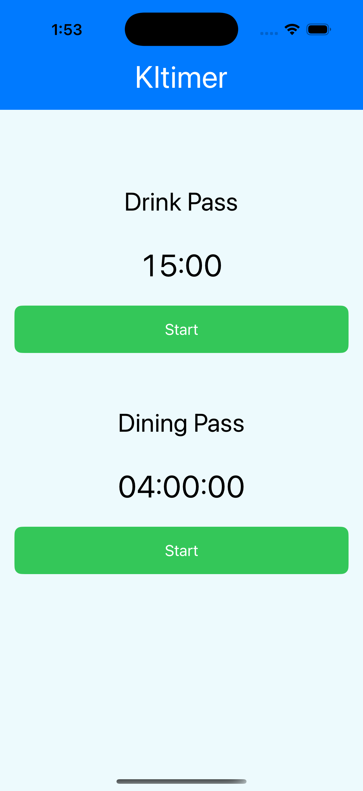
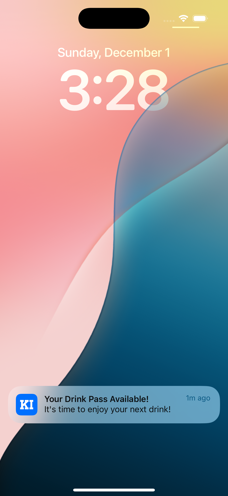

# KItimer

KItimer is a countdown timer app designed specifically for **Kings Island** visitors in Ohio. The app helps users track the availability of their **Drink Pass** (15-minute cooldown) and **Dining Pass** (4-hour cooldown) with easy-to-use timers and notifications. Even when the app is in the background, KItimer ensures accurate countdowns and timely reminders.

---

## Features

### 🕒 Timer Management
- **Drink Pass Timer**: Counts down from 15 minutes, displayed in `mm:ss` format.
- **Dining Pass Timer**: Counts down from 4 hours, displayed in `hh:mm:ss` format.
- Accurate countdowns, even when the app is in the background.

### 🔔 Notifications
- Alerts users when their pass is available again:
  - Drink Pass: *"Your Drink Pass is Available!"*
  - Dining Pass: *"Your Dining Pass is Available!"*
- Notifications work seamlessly even if the app is not active.
- Resetting the timer cancels all scheduled notifications.

### 🎨 User Interface
- Minimalist design with intuitive controls:
  - **Start Button**: Green when active; disables after starting.
  - **Reset Button**: Red and only visible after the timer starts.
  - Dynamic alignment ensures the interface doesn’t interfere with iPhone features like the Dynamic Island.

### ⚙️ Background Time Handling
- Tracks elapsed time while the app is in the background to ensure accurate countdowns upon return.
- Prevents unintended restarts for other timers when switching between foreground and background states.

## How It Works

1. **Start the Timer**:
   - Tap the **Start** button to begin a countdown for either the Drink Pass or Dining Pass.
   - The timer starts counting down, and a notification is scheduled for when the timer ends.

2. **Background Operation**:
   - If you close or minimize the app, the timer continues to track the time elapsed.
   - Upon reopening, the timer adjusts for the time spent in the background.

3. **Reset the Timer**:
   - Tap the **Reset** button to stop the timer and return it to its initial state.
   - All notifications tied to the timer are canceled.

## Use Case: Kings Island, Ohio 🎢
This app is tailored for use at **Kings Island**, a popular amusement park in Ohio. Visitors can use the app to manage their **Drink Pass** and **Dining Pass** efficiently, ensuring they never miss their refreshment opportunities while enjoying the park!

## Setup & File Structure

### File Structure
- `KItimerApp.swift`: Entry point of the app.
- `NotificationManager.swift`: Manages local notifications for both passes.
- `ContentView.swift`: The main user interface for managing passes.
- `TimerView.swift`: Handles the timer logic, including background tracking and notifications.

### Requirements
- iOS 16.0 or later
- Swift 5.0 or later
- Xcode 14 or later

### Setup Instructions
1. Clone this repository:
  ```bash
  git clone https://github.com/your-username/KItimer.git
  ```
2. Open the project in Xcode.
3. Build and run the app on your iOS device.
4. Grant notification permissions when prompted.

## Screenshots

### Home Screen
Displays the timers for Drink Pass and Dining Pass with Start and Reset buttons.



### Notification
Displays a reminder when the Drink Pass or Dining Pass is available again.



## Contributing
We welcome contributions to improve KItimer! If you'd like to contribute:
1. Fork the repository.
2. Create a new branch:
  ```bash
  git checkout -b feature-name
  ```
3. Make your changes and commit:
  ```bash
  git commit -m "Add new feature"
  ```
4. Push your branch:
  ```bash
  git push origin feature-name
  ```
5. Submit a pull request!

## License
This project is licensed under the MIT License. See the [LICENSE](./LICENSE) for more details.

**Enjoy your day at Kings Island with KItimer!** 🎉

